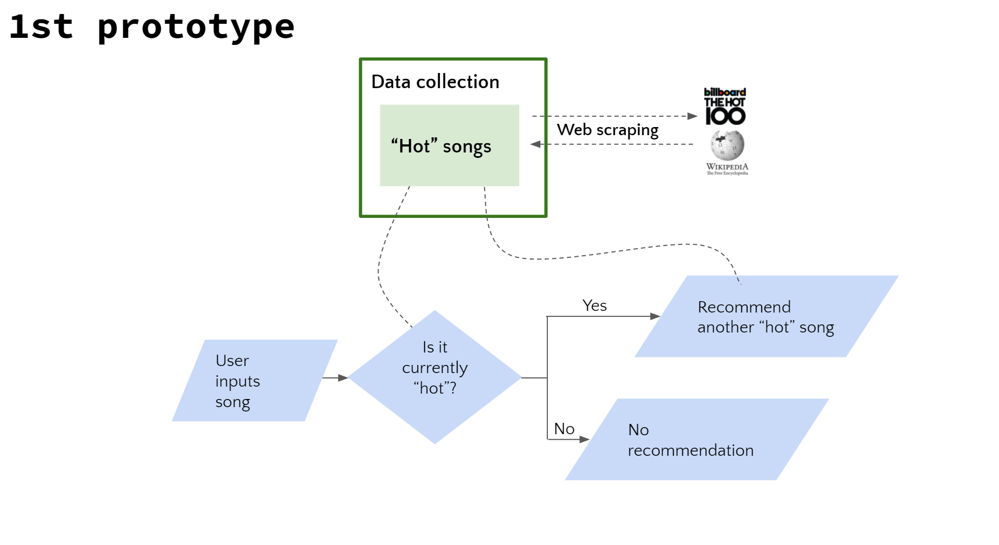
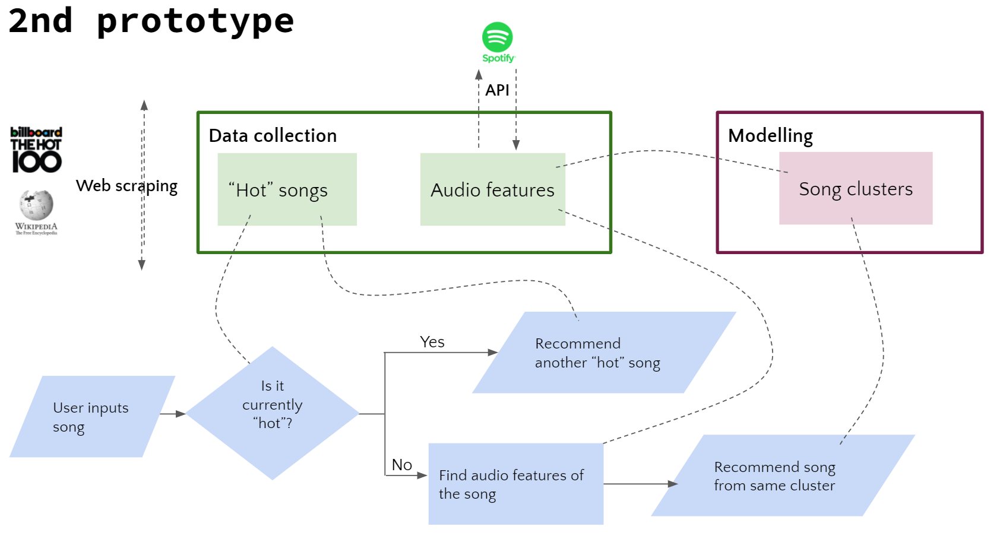
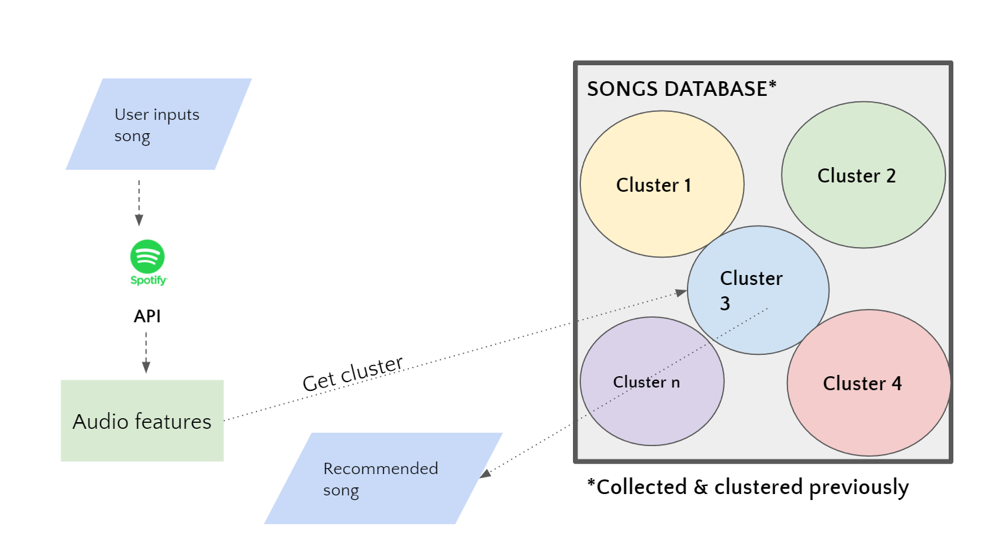

# Song_Recommender_Project

**Objective**: In this project an Spotify Song Recommender has been built  from scratch. The project involved web Scraping to obtain a so called "hot songs" database and the use of Spotify API to build a diverse database with songs of many genres. This Spotify Database has been used to develop a kmeans clustering model and ultimately a audio features based song recommender.

**Tools used: Python, Numpy, Pandas, Matplotlib, Web Scraping (Beautiful Soup), Spotify API, sklearn**

**Aproach**: 

- First Prototype - Hot Song Recommender

This first prototype only includes the hot song recommender. The  flow chart of the recommender is as in image below.

- Second Prototype

The second and final prototype includes the hot song recommender and the audio features based recommender. The flow chart of the programm is as in image below.

The modelling (kmeans clustering) process is detailed in image below.

